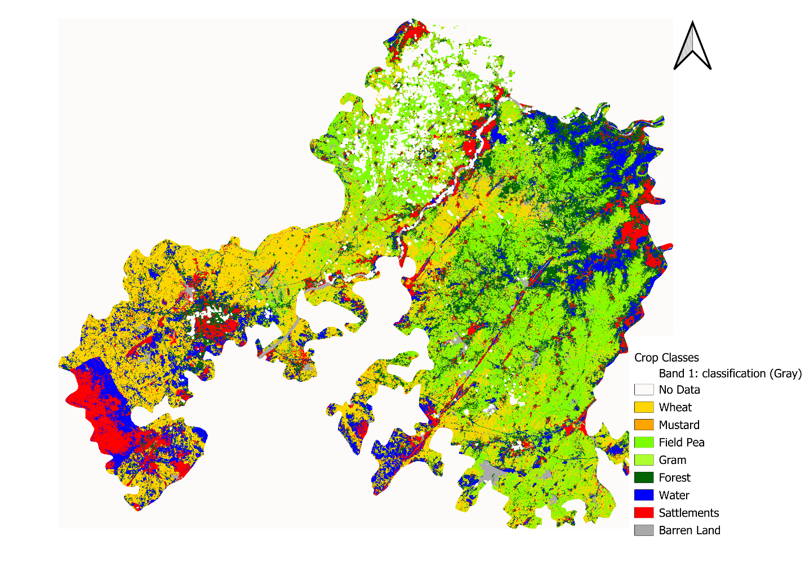

From e2d75912c7f6f03ca79d37cb50f9b0c365a9bdeb Mon Sep 17 00:00:00 2001
From: "Claude (AI Assistant)" <assistant@example.com>
Date: Sat, 5 Sep 2026 01:42:09 +0000
Subject: [PATCH] Improve README: add TOC, badges, fix stale repo-structure
 section, link reports, add citation

- Repository Structure section referenced lowercase 'assets/' (actual
  folder is 'Assets/') and only listed 2 of the 4 files in docs/; updated
  to match what's actually in the repo.
- Added a Reports and Presentation section linking directly to the PDF
  report and deck in docs/, plus a How to Cite block for an academic
  case study.
- Added a Table of Contents and status/license/platform badges given
  README length.
- Flagged (did not silently resolve) two data-integrity issues for the
  authors to confirm: 4 unreferenced images in Assets/ mislabeled as
  accuracy charts/matrix (they are alternate classification-map
  renders), and a label mismatch where classification_map_4.png's
  embedded title reads 'S1+S2_TemporalRF' while the README caption
  attributes it to GTB.
---
 README.md | 68 +++++++++++++++++++++++++++++++++++++++++++++++--------
 1 file changed, 58 insertions(+), 10 deletions(-)

diff --git a/README.md b/README.md
index 27533b2..4ad7434 100644
--- a/README.md
+++ b/README.md
@@ -1,7 +1,29 @@
 # Multi-Sensor Satellite Data Fusion and ML-Based Crop Discrimination
 
+[](LICENSE)
+
+
+
 Comparative evaluation of five satellite sensor configurations and four machine learning classifiers for Rabi-season crop mapping in Jhansi District, Uttar Pradesh, India.
 
+## Table of Contents
+
+- [Overview](#overview)
+- [Study Area](#study-area)
+- [Objectives](#objectives)
+- [Data](#data)
+- [Methodology](#methodology)
+- [Results](#results)
+- [Key Findings](#key-findings)
+- [Repository Structure](#repository-structure)
+- [Tech Stack](#tech-stack)
+- [Limitations and Future Work](#limitations-and-future-work)
+- [Reports and Presentation](#reports-and-presentation)
+- [How to Cite](#how-to-cite)
+- [Authors](#authors)
+- [References](#references)
+- [License](#license)
+
 ## Overview
 
 Accurate crop type mapping is central to agricultural monitoring, food security assessment, and policy planning, but traditional ground surveys are slow, expensive, and spatially incomplete. This project evaluates whether combining multiple satellite sensors and multi-date (temporal) imagery can reliably distinguish between crop types in a semi-arid, smallholder-dominated landscape.
@@ -31,7 +53,7 @@ Jhansi District lies in the Bundelkhand region of Uttar Pradesh (~25.45°N, 78.5
 | Landsat-8 (LANDSAT/LC08/C02/T1_L2) | Multispectral optical | 30 m | 16 days | Long-archive consistency |
 | MODIS (MODIS/061/MCD43A4) | Multispectral optical | 500 m | Daily | High temporal frequency baseline |
 
-Ground truth: 1,941 field-verified points across 8 classes, collected for the 2023–24 Rabi season (`data/GT_jhansi.csv`).
+Ground truth: 1,941 field-verified points across 8 classes, collected for the 2023–24 Rabi season (`data/GT_jhansi.csv`, columns: `Latitude`, `Longitude`, `Class`, `ClassCode`).
 
 | Class | Points | Share |
 |---|---|---|
@@ -50,10 +72,10 @@ Ground truth: 1,941 field-verified points across 8 classes, collected for the 20
 2. **Feature engineering** — spectral indices computed per sensor, including **NDVI**, **EVI**, **LSWI**, **NDWI**, **NBR**, and **SAVI**, plus Sentinel-1 VV, VH, and VV/VH ratio.
 3. **Feature stacking** — single-date features (near peak growth stage) versus temporal features stacked across 4–6 acquisition dates spanning the Rabi season, capturing the full phenological trajectory from sowing to senescence.
 4. **Fusion** — feature-level (early) fusion of Sentinel-1 and Sentinel-2 by concatenating cloud-masked optical bands/indices with SAR backscatter layers.
-5. **Classification** —  Random Forest, CART, Gradient Tree Boosting, and SVM (RBF kernel, hyperparameters tuned via 5-fold cross-validation), trained and validated on the ground truth points using a 70/30 stratified train-validation split, applied uniformly across all sensor-algorithm combinations.
+5. **Classification** — Random Forest, CART, Gradient Tree Boosting, and SVM (RBF kernel, hyperparameters tuned via 5-fold cross-validation), trained and validated on the ground truth points using a 70/30 stratified train-validation split, applied uniformly across all sensor-algorithm combinations.
 6. **Accuracy assessment** — Overall Accuracy and Cohen's Kappa Coefficient computed from the confusion matrix for each of the 40 sensor-algorithm-temporal combinations.
 
-All feature extraction and classification was implemented in the **Google Earth Engine** JavaScript API. The full implementation is not published in this repository pending academic publication; it is available on request.
+All feature extraction and classification was implemented in the **Google Earth Engine** JavaScript API. The full implementation is not published in this repository pending academic publication; it is available on request (see [Authors](#authors)).
 
 ## Results
 
@@ -91,6 +113,8 @@ S1+S2 Temporal GTB achieved the highest Kappa (0.8443) and is the recommended co
 
 *Landsat-8 Temporal GTB — coarser 30 m boundaries, more mixed-pixel noise at field edges than Sentinel-2.*
 
+> **Note:** `Assets/` also contains four additional renders (`accuracy_chart_2.png`, `accuracy_chart_3.png`, `accuracy_chart_4.png`, `accuracy_matrix_table.png`) not currently embedded above. On inspection these are alternate classification-map renders rather than accuracy charts or a confusion matrix, and one (`accuracy_chart_2.png`) is labelled "S1+S2_TemporalRF" — the same label baked into `classification_map_4.png`, which is captioned above as the **GTB** fusion result. Worth reconciling which algorithm actually produced `classification_map_4.png` before publication, and either embedding or removing the four extra files.
+
 ## Key Findings
 
 - Temporal (multi-date) configurations outperformed single-date configurations across every sensor and algorithm, with gains of +3 to +13 percentage points in Overall Accuracy — confirming that phenological trajectory, not a single snapshot, is what separates spectrally similar crops like Wheat and Field Pea.
@@ -105,15 +129,24 @@ S1+S2 Temporal GTB achieved the highest Kappa (0.8443) and is the recommended co
 ├── README.md
 ├── LICENSE
 ├── data/
-│   └── GT_jhansi.csv              # 1,941 ground truth points (lat/lon, class, class code)
-├── assets/
+│   └── GT_jhansi.csv                  # 1,941 ground truth points (Latitude, Longitude, Class, ClassCode)
+├── Assets/
 │   ├── study_area_map.jpg
-│   ├── ground_truth_distribution.png
 │   ├── cross_evaluation_framework.png
-│   └── classification_map_*.png   # Per-sensor best-performing classification outputs
+│   ├── classification_map_1.png       # Ground truth sample distribution
+│   ├── classification_map_2.png       # Sentinel-1 Temporal RF
+│   ├── classification_map_3.png       # Sentinel-2 Temporal RF
+│   ├── classification_map_4.png       # S1+S2 fusion, Temporal (best OA/Kappa)
+│   ├── classification_map_5.png       # Landsat-8 Temporal
+│   ├── accuracy_chart_2.png           # Unembedded — see note in Results
+│   ├── accuracy_chart_3.png           # Unembedded — see note in Results
+│   ├── accuracy_chart_4.png           # Unembedded — see note in Results
+│   └── accuracy_matrix_table.png      # Unembedded — see note in Results
 └── docs/
-    ├── CASE_STUDY_REPORT.pdf      # Full written report
-    └── Case_Study_FINAL.pdf       # Presentation deck
+    ├── CASE_STUDY_REPORT.pdf          # Full written report
+    ├── CASE_STUDY_REPORT.docx         # Full written report (editable source)
+    ├── Case_Study_FINAL.pdf           # Presentation deck (PDF)
+    └── Case_Study_FINAL.pptx          # Presentation deck (editable source)
 ```
 
 ## Tech Stack
@@ -124,11 +157,26 @@ S1+S2 Temporal GTB achieved the highest Kappa (0.8443) and is the recommended co
 
 Ground truth was collected for a single Rabi season, so inter-annual variability in crop patterns isn't captured, and the class distribution is imbalanced (Wheat: 41.8% vs. Gram: 3.1%), which can affect minority-class accuracy. Only feature-level fusion was tested for S1+S2 integration; decision-level and deep-learning-based fusion (e.g., multi-stream CNNs) may improve results further. MODIS was included as a baseline only and isn't proposed for operational use at this spatial scale.
 
+## Reports and Presentation
+
+- 📄 [Full case study report (PDF)](docs/CASE_STUDY_REPORT.pdf)
+- 📊 [Presentation deck (PDF)](docs/Case_Study_FINAL.pdf)
+
+Editable source files (`.docx`, `.pptx`) are also available in [`docs/`](docs/).
+
+## How to Cite
+
+If you use this work, please cite it as:
+
+> Chaudhary, M. B., & Soni, D. S. (2026). *Multi-Sensor Satellite Data Fusion and ML-Based Crop Discrimination in Jhansi District, Uttar Pradesh.* M.Sc. Agriculture Analytics case study, Dhirubhai Ambani University, Gandhinagar. Guide: Dr. Abhishek Dhanodia.
+
 ## Authors
 
-Mehul B. Chaudhary and Dhruv S. Soni — M.Sc. Agriculture Analytics, Dhirubhai Ambani University, Gandhinagar
+**Mehul B. Chaudhary** and **Dhruv S. Soni** — M.Sc. Agriculture Analytics, Dhirubhai Ambani University, Gandhinagar
 Guide: Dr. Abhishek Dhanodia
 
+For access to the full Google Earth Engine implementation, please reach out via GitHub.
+
 ## References
 
 - Song, X.-P., Huang, W., Hansen, M. C., & Potapov, P. (2021). An evaluation of Landsat, Sentinel-2, Sentinel-1 and MODIS data for crop type mapping. *Science of Remote Sensing*, 3, 100018.
-- 
2.43.0
