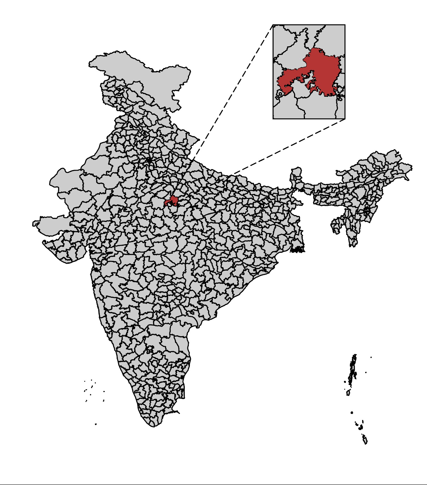
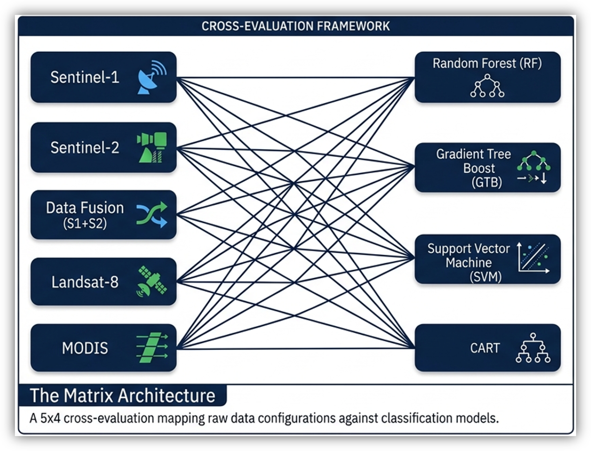
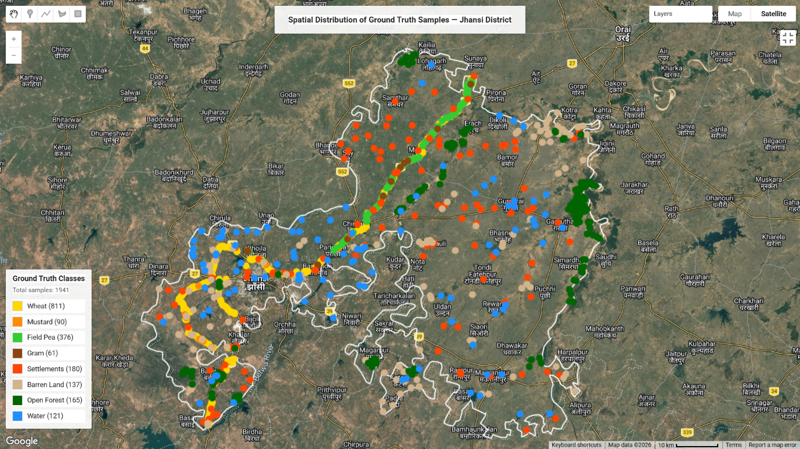
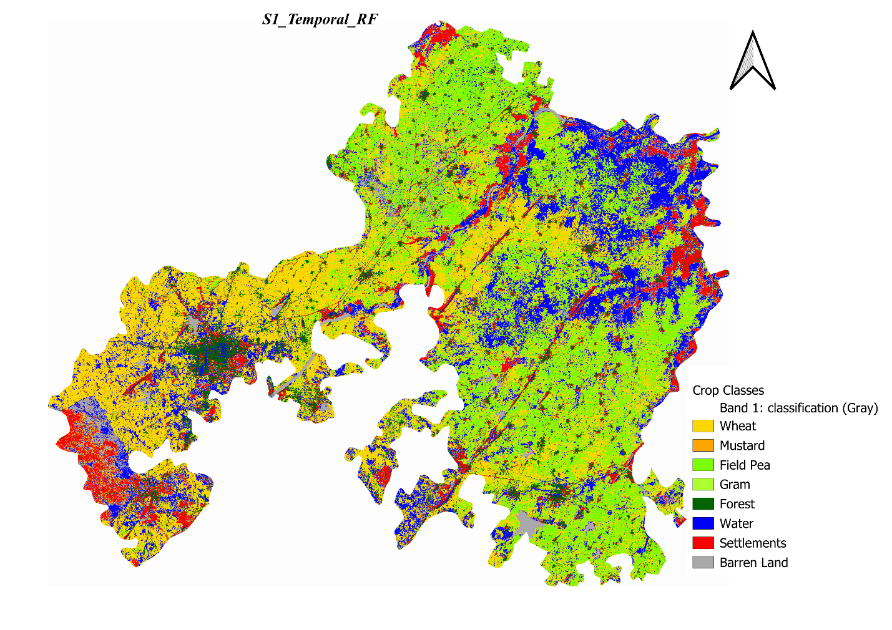
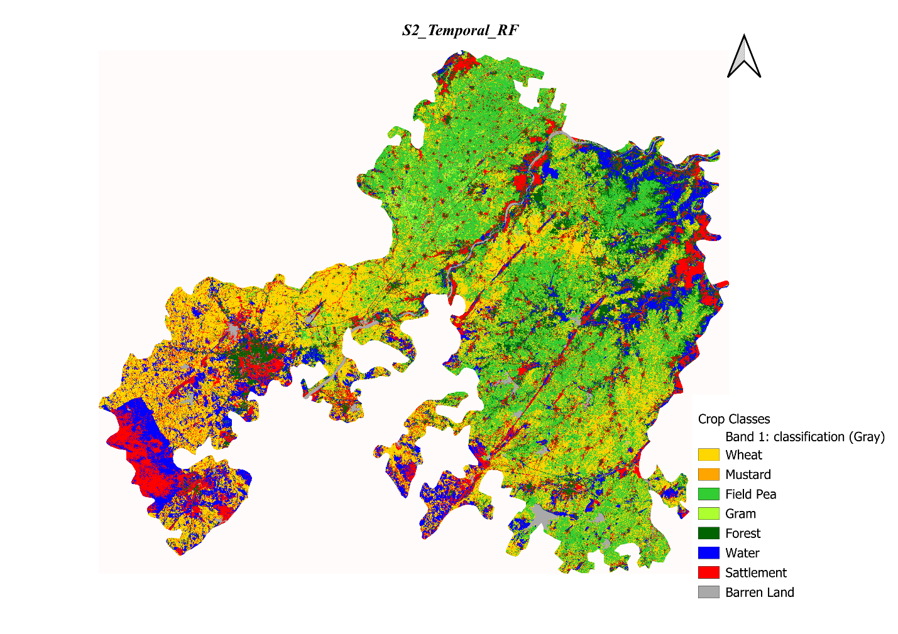
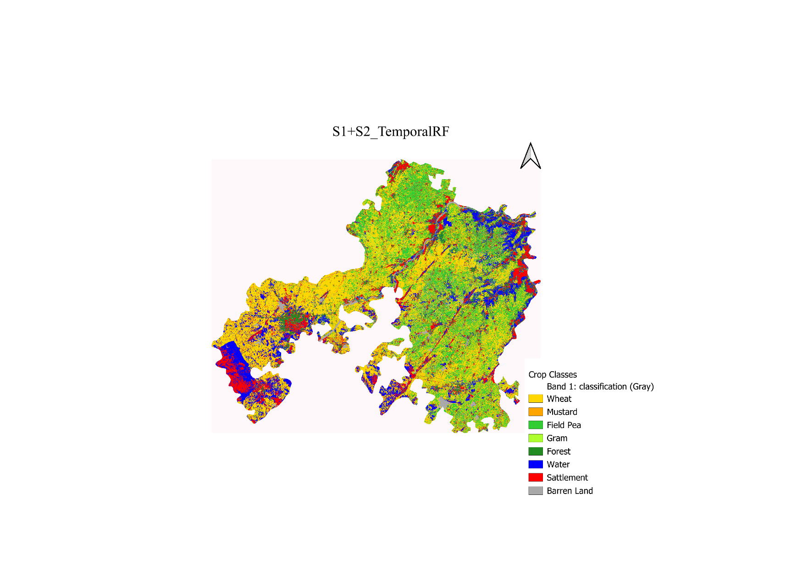

# Multi-Sensor Satellite Data Fusion and ML-Based Crop Discrimination

[](LICENSE)


Comparative evaluation of five satellite sensor configurations and four machine learning classifiers for Rabi-season crop mapping in Jhansi District, Uttar Pradesh, India.

## Table of Contents

- [Overview](#overview)
- [Study Area](#study-area)
- [Objectives](#objectives)
- [Data](#data)
- [Methodology](#methodology)
- [Results](#results)
- [Key Findings](#key-findings)
- [Repository Structure](#repository-structure)
- [Tech Stack](#tech-stack)
- [Limitations and Future Work](#limitations-and-future-work)
- [Reports and Presentation](#reports-and-presentation)
- [How to Cite](#how-to-cite)
- [Authors](#authors)
- [References](#references)
- [License](#license)

## Overview

Accurate crop type mapping is central to agricultural monitoring, food security assessment, and policy planning, but traditional ground surveys are slow, expensive, and spatially incomplete. This project evaluates whether combining multiple satellite sensors and multi-date (temporal) imagery can reliably distinguish between crop types in a semi-arid, smallholder-dominated landscape.

The study compares **Sentinel-1** (SAR), **Sentinel-2** (multispectral optical), **Landsat-8** (multispectral optical), **MODIS** (coarse-resolution optical), and a **Sentinel-1 + Sentinel-2 fusion** dataset, each classified under single-date and temporal (multi-date) configurations using **Random Forest**, **CART**, **Gradient Tree Boosting**, and **SVM**. All processing was carried out on **Google Earth Engine**, using 1,941 field-verified ground truth points across eight land-cover classes.

## Study Area

Jhansi District lies in the Bundelkhand region of Uttar Pradesh (~25.45°N, 78.57°E), a semi-arid zone with a mix of irrigated and rain-fed farming. The dominant Rabi-season crops are Wheat, Mustard, Gram, and Field Pea, alongside Barren Land, Settlements, Open Forest, and Water as non-agricultural classes.



## Objectives

- Compare classification performance across Sentinel-1, Sentinel-2, Landsat-8, MODIS, and S1+S2 fusion for Rabi crop discrimination.
- Quantify the accuracy gain from temporal (multi-date) compositing over single-date imagery.
- Benchmark Random Forest, CART, Gradient Tree Boosting, and SVM across all sensor-configuration combinations.
- Identify the optimal sensor-algorithm combination for operational crop type mapping.
- Produce spatially explicit classification maps for the study area.

## Data

| Source | Type | Resolution | Revisit | Role |
|---|---|---|---|---|
| Sentinel-2 (COPERNICUS/S2_SR_HARMONIZED) | Multispectral optical | 10 m | 5 days | High-resolution spectral discrimination |
| Sentinel-1 (COPERNICUS/S1_GRD) | SAR, C-band | 10 m | 6 days | Cloud-penetrating structure/moisture signal |
| Landsat-8 (LANDSAT/LC08/C02/T1_L2) | Multispectral optical | 30 m | 16 days | Long-archive consistency |
| MODIS (MODIS/061/MCD43A4) | Multispectral optical | 500 m | Daily | High temporal frequency baseline |

Ground truth: 1,941 field-verified points across 8 classes, collected for the 2023–24 Rabi season (`data/GT_jhansi.csv`, columns: `Latitude`, `Longitude`, `Class`, `ClassCode`).

| Class | Points | Share |
|---|---|---|
| Wheat | 811 | 41.8% |
| Field Pea | 376 | 19.4% |
| Settlements | 180 | 9.3% |
| Open Forest | 165 | 8.5% |
| Barren Land | 137 | 7.1% |
| Water | 121 | 6.2% |
| Mustard | 90 | 4.6% |
| Gram | 61 | 3.1% |

## Methodology

1. **Preprocessing** — radiometric calibration, atmospheric correction, cloud/shadow masking, and geometric co-registration on all optical datasets.
2. **Feature engineering** — spectral indices computed per sensor, including **NDVI**, **EVI**, **LSWI**, **NDWI**, **NBR**, and **SAVI**, plus Sentinel-1 VV, VH, and VV/VH ratio.
3. **Feature stacking** — single-date features (near peak growth stage) versus temporal features stacked across 4–6 acquisition dates spanning the Rabi season, capturing the full phenological trajectory from sowing to senescence.
4. **Fusion** — feature-level (early) fusion of Sentinel-1 and Sentinel-2 by concatenating cloud-masked optical bands/indices with SAR backscatter layers.
5. **Classification** — Random Forest, CART, Gradient Tree Boosting, and SVM (RBF kernel, hyperparameters tuned via 5-fold cross-validation), trained and validated on the ground truth points using a 70/30 stratified train-validation split, applied uniformly across all sensor-algorithm combinations.
6. **Accuracy assessment** — Overall Accuracy and Cohen's Kappa Coefficient computed from the confusion matrix for each of the 40 sensor-algorithm-temporal combinations.

All feature extraction and classification was implemented in the **Google Earth Engine** JavaScript API. The full implementation is not published in this repository pending academic publication; it is available on request (see [Authors](#authors)).

## Results

Best-performing configuration per sensor:

| Sensor | Best Configuration | Algorithm | Overall Accuracy | Kappa |
|---|---|---|---|---|
| Sentinel-1 (SAR) | Temporal | RF | 77.52% | 0.7246 |
| Sentinel-2 (Optical) | Temporal | RF | 85.00% | 0.8170 |
| Landsat-8 | Temporal | SVM | 89.74% | 0.7906 |
| MODIS | Single-Date | RF | 63.11% | 0.5357 |
| **Sentinel-1 + Sentinel-2 (Fusion)** | **Temporal** | **GTB** | **87.22%** | **0.8443** |

S1+S2 Temporal GTB achieved the highest Kappa (0.8443) and is the recommended configuration overall. Sentinel-2 Temporal RF is the strongest practical single-sensor choice where SAR processing isn't available. Landsat-8 Temporal SVM posted the highest raw Overall Accuracy but a comparatively lower Kappa, suggesting Kappa is the more defensible metric for comparing sensors given class imbalance in the ground truth.

**Cross-evaluation framework** — all 5 sensor configurations were tested against all 4 classifiers (20 combinations, doubled across single-date and temporal variants):



**Ground truth sample distribution** — 1,941 field-verified points across 8 classes, overlaid on Jhansi District:



**Classification maps** — best-performing algorithm per sensor, Rabi season 2023-24:


*Sentinel-1 Temporal RF (OA 77.52%) — SAR-only classification, more misclassification noise between Wheat and Field Pea.*


*Sentinel-2 Temporal RF (OA 85.00%) — sharper class boundaries from 10 m optical resolution.*


*Sentinel-1 + Sentinel-2 fusion, Temporal GTB (OA 87.22%) — best overall map in the study; improved separation of Gram and Field Pea.*


*Landsat-8 Temporal GTB — coarser 30 m boundaries, more mixed-pixel noise at field edges than Sentinel-2.*

> **Note:** `Assets/` also contains four additional renders (`accuracy_chart_2.png`, `accuracy_chart_3.png`, `accuracy_chart_4.png`, `accuracy_matrix_table.png`) not currently embedded above. On inspection these are alternate classification-map renders rather than accuracy charts or a confusion matrix, and one (`accuracy_chart_2.png`) is labelled "S1+S2_TemporalRF" — the same label baked into `classification_map_4.png`, which is captioned above as the **GTB** fusion result. Worth reconciling which algorithm actually produced `classification_map_4.png` before publication, and either embedding or removing the four extra files.

## Key Findings

- Temporal (multi-date) configurations outperformed single-date configurations across every sensor and algorithm, with gains of +3 to +13 percentage points in Overall Accuracy — confirming that phenological trajectory, not a single snapshot, is what separates spectrally similar crops like Wheat and Field Pea.
- SAR-optical fusion (S1+S2) outperformed Sentinel-2 alone, showing that radar backscatter and optical reflectance carry complementary information about canopy structure and moisture that neither sensor resolves independently.
- Ensemble tree-based methods (Random Forest, Gradient Tree Boosting) consistently outperformed CART and, in most cases, SVM — GTB led in fusion and optical temporal setups, RF was the most consistent performer with lower sensitivity to hyperparameter tuning.
- Spatial resolution was the dominant constraint on class-level accuracy: Sentinel-2 (10 m) > Landsat-8 (30 m) >> MODIS (500 m). MODIS is not suitable for field-scale crop mapping in smallholder landscapes like Jhansi.
- Sentinel-1 alone showed the largest relative gain from temporal stacking (+12.8 points on average), indicating single-date SAR is a weak standalone classifier but a strong complement once multiple acquisitions are available.

## Repository Structure

```
├── README.md
├── LICENSE
├── data/
│   └── GT_jhansi.csv                  # 1,941 ground truth points (Latitude, Longitude, Class, ClassCode)
├── Assets/
│   ├── study_area_map.jpg
│   ├── cross_evaluation_framework.png
│   ├── classification_map_1.png       # Ground truth sample distribution
│   ├── classification_map_2.png       # Sentinel-1 Temporal RF
│   ├── classification_map_3.png       # Sentinel-2 Temporal RF
│   ├── classification_map_4.png       # S1+S2 fusion, Temporal (best OA/Kappa)
│   ├── classification_map_5.png       # Landsat-8 Temporal
│   ├── accuracy_chart_2.png           # Unembedded — see note in Results
│   ├── accuracy_chart_3.png           # Unembedded — see note in Results
│   ├── accuracy_chart_4.png           # Unembedded — see note in Results
│   └── accuracy_matrix_table.png      # Unembedded — see note in Results
└── docs/
    ├── CASE_STUDY_REPORT.pdf          # Full written report
    ├── CASE_STUDY_REPORT.docx         # Full written report (editable source)
    ├── Case_Study_FINAL.pdf           # Presentation deck (PDF)
    └── Case_Study_FINAL.pptx          # Presentation deck (editable source)
```

## Tech Stack

**Google Earth Engine** (JavaScript API) for image collection processing, index computation, and classifier training/validation. **Python** and **pandas** for ground truth handling and post-processing. Classifiers: **Random Forest**, **CART**, **Gradient Tree Boosting**, **SVM (RBF kernel)**. Accuracy metrics: **Overall Accuracy**, **Cohen's Kappa Coefficient**.

## Limitations and Future Work

Ground truth was collected for a single Rabi season, so inter-annual variability in crop patterns isn't captured, and the class distribution is imbalanced (Wheat: 41.8% vs. Gram: 3.1%), which can affect minority-class accuracy. Only feature-level fusion was tested for S1+S2 integration; decision-level and deep-learning-based fusion (e.g., multi-stream CNNs) may improve results further. MODIS was included as a baseline only and isn't proposed for operational use at this spatial scale.

## Reports and Presentation

- 📄 [Full case study report (PDF)](docs/CASE_STUDY_REPORT.pdf)
- 📊 [Presentation deck (PDF)](docs/Case_Study_FINAL.pdf)

Editable source files (`.docx`, `.pptx`) are also available in [`docs/`](docs/).

## How to Cite

If you use this work, please cite it as:

> Chaudhary, M. B., & Soni, D. S. (2026). *Multi-Sensor Satellite Data Fusion and ML-Based Crop Discrimination in Jhansi District, Uttar Pradesh.* M.Sc. Agriculture Analytics case study, Dhirubhai Ambani University, Gandhinagar. Guide: Dr. Abhishek Dhanodia.

## Authors

**Mehul B. Chaudhary** and **Dhruv S. Soni** — M.Sc. Agriculture Analytics, Dhirubhai Ambani University, Gandhinagar
Guide: Dr. Abhishek Dhanodia

For access to the full Google Earth Engine implementation, please reach out via GitHub.

## References

- Song, X.-P., Huang, W., Hansen, M. C., & Potapov, P. (2021). An evaluation of Landsat, Sentinel-2, Sentinel-1 and MODIS data for crop type mapping. *Science of Remote Sensing*, 3, 100018.
- He, J., Zeng, W., Ao, C., Xing, W., Gaiser, T., & Srivastava, A. K. (2024). Cross-regional crop classification based on Sentinel-2. *Agronomy*, 14, 1084.
- Gumma, M. K., Tummala, K., Dixit, S., Collivignarelli, F., Holecz, F., Kolli, R. N., & Whitbread, A. M. (2020). Crop type identification and spatial mapping using Sentinel-2 satellite data. *Geocarto International*.
- Saini, R., & Ghosh, S. K. (2018). Crop classification on single date Sentinel-2 imagery using random forest and support vector machine. *ISPRS Archives*, XLII-5, 683-688.
- Kobayashi, N., Tani, H., Wang, X., & Sonobe, R. (2020). Crop classification using spectral indices derived from Sentinel-2A imagery. *Journal of Information and Telecommunication*, 4(1), 67-90.

## License

This project is licensed under the MIT License — see [LICENSE](LICENSE) for details.
